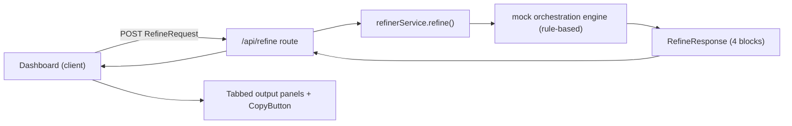

## The Vibe Coder Prompt Refiner Tool — Architecture & File-Mapping Strategy

### 1. High-level design

A split-screen dashboard. Left = input (raw idea textarea + config toggles + Refine CTA). Right = tabbed panels rendering the 4 outputs with one-click copy. The frontend posts to `/api/refine`, which delegates to a deterministic, free, rule-based engine that returns a typed 4-part schema. No database, no external API keys, fully Vercel-free-tier hostable.



### 2. Tech stack

- Next.js 16 App Router + React 19, TypeScript (strict).
- Tailwind CSS 4.0 (CSS-first `@import "tailwindcss"` + `@theme` inline config, no legacy `tailwind.config.js` directives).
- shadcn/ui primitives (Button, Tabs, Textarea, Switch, Select, Card, Sonner toast) — React 19 compatible.
- Geist Sans/Mono via `next/font`.
- Zod for request/response validation (per user standards).
- Vitest + React Testing Library for unit tests of the service engine (user rules ask Jest; I am proposing Vitest as the modern Next 16/ESM-friendly default — flagged below).

### 3. Data models (`src/lib/types.ts` + `src/lib/schemas.ts`)

```ts
// Input
type TargetIDE = "cursor" | "copilot-workspace";
type ProjectType = "web-app" | "api" | "mobile" | "cli" | "saas" | "other";
type Verbosity = "concise" | "balanced" | "exhaustive";

interface RefineRequest {
  idea: string;            // raw user idea (validated: 10-5000 chars)
  targetIDE: TargetIDE;
  projectType: ProjectType;
  verbosity: Verbosity;
  includeTests: boolean;
  preferOpenSource: boolean;
}

// Output (the 4 blocks)
interface TechChoice { name: string; reason: string; category: string }
interface FeatureItem { label: string; priority: "core" | "nice-to-have" }
interface RefineResult {
  refinedPrompt: string;          // markdown mega-prompt
  techStack: TechChoice[];        // rendered as grouped list
  features: FeatureItem[];        // split into Core MVP / Nice to Have
  architectureTree: string;       // text tree diagram
}

// Standard API envelope (per user API rules)
interface ApiResponse<T> { success: boolean; data: T | null; error: string | null; message: string }
```

Zod schemas mirror these; the route validates input with `RefineRequestSchema.safeParse`.

### 4. The mock orchestration engine (the core, free logic)

Location: `src/lib/refiner/`. Deterministic and keyword-driven so it runs 100% free, but designed behind an interface so a real LLM can be dropped in later without touching the UI or route.

- `engine.interface.ts` — `interface RefinerEngine { refine(req: RefineRequest): RefineResult }`.
- `mock-engine.ts` — implements the interface. Pipeline of pure functions:
  - `detectDomain(idea)` — keyword map (e.g. "chat/dental/booking" -> saas, "store/cart" -> ecommerce) to bias outputs.
  - `buildRefinedPrompt(req, domain)` — assembles a structured markdown mega-prompt (role, context, constraints, the user's idea, acceptance criteria), adapting tone/length to `verbosity` and headers to `targetIDE`.
  - `recommendStack(domain, req)` — returns `TechChoice[]`, honoring `preferOpenSource` and project type; defaults align with `.cursorrules` (Next.js 16, Supabase, Tailwind 4).
  - `buildFeatureList(domain, req)` — base Core MVP + Nice-to-Have lists merged with domain-specific extras; adds testing/auth items when toggled.
  - `buildArchitectureTree(req, domain)` — generates a text tree string matching the chosen stack/project type.
- `index.ts` — exports a singleton `refinerService` (factory returns the mock engine; swap point for future LLM engine).

This separation satisfies the user's "routes / controllers / services" concern split: route = controller, `refinerService` = service, engine functions = domain logic.

### 5. Proposed file tree

```
prompt-refiner/
  src/
    app/
      layout.tsx               # root layout, fonts, <body bg-zinc-950>
      page.tsx                 # redirect/landing -> renders Dashboard
      globals.css              # Tailwind 4 @import + @theme tokens
      api/
        v1/
          refine/
            route.ts           # POST handler, Zod validate, ApiResponse envelope
    components/
      dashboard/
        Dashboard.tsx          # split-screen layout shell (client)
        InputPanel.tsx         # textarea + toggles + Refine button
        OutputPanel.tsx        # Tabs container for 4 outputs
        tabs/
          RefinedPromptTab.tsx
          TechStackTab.tsx
          FeatureListTab.tsx
          ArchitectureTab.tsx
      ui/                      # shadcn primitives (button, tabs, textarea, switch, select, card, sonner)
      shared/
        CopyButton.tsx         # one-click clipboard + toast
        GlowCard.tsx           # reusable neon-bordered card
        Header.tsx             # brand/title bar
    lib/
      types.ts
      schemas.ts               # Zod
      refiner/
        engine.interface.ts
        mock-engine.ts
        domain-data.ts         # keyword maps, stack presets, feature presets
        index.ts               # refinerService singleton
      utils.ts                 # cn() helper
    hooks/
      useRefine.ts             # client fetch state: idle/loading/success/error
  tests/
    mock-engine.test.ts        # unit tests for each pure function
  .env.example                 # no secrets needed; placeholder for future LLM key
  package.json
  tsconfig.json
  next.config.ts
  postcss.config.mjs
  components.json              # shadcn config
  README.md
```

### 6. Frontend behavior & state

- `useRefine` hook holds request state machine (`idle | loading | success | error`) and the `RefineResult`.
- Loading: skeleton/shimmer + disabled CTA with animated "Refining..." state.
- `OutputPanel` uses shadcn `Tabs`; each tab renders its block; `CopyButton` writes the raw markdown/text to clipboard and fires a Sonner toast.
- Empty state on right panel before first run (cyberpunk placeholder).
- Fully responsive: split-screen on `lg+`, stacked (input on top, outputs below) on mobile.

### 7. Design system (Tailwind 4 `@theme`)

- Background `zinc-950`, surfaces `zinc-900`, borders `zinc-800`, text `zinc-50`.
- Accent neon violet `violet-500` for active tab, CTA, focus rings, and subtle glow (`shadow-[0_0_20px_theme(violet-500/30)]`).
- Geist Sans body, Geist Mono for code/tree blocks.

### 8. API contract (`/api/v1/refine`, POST — versioned per user rules)

- Input: `RefineRequest` (JSON). Validates with Zod; on failure returns `{ success:false, error, message }` with 400.
- Success: `{ success:true, data: RefineResult, error:null, message }` with 200.
- Wrapped in try/catch returning meaningful errors.

### 9. Notable decisions / flags

- Engine is deterministic rule-based (your "local mock orchestration service, 100% free") but behind `RefinerEngine` interface so a real LLM is a drop-in later. No API keys required to run.
- Config toggles (unspecified in brief) defined as: Target IDE, Project Type, Verbosity, Include Tests, Prefer Open Source.
- API path uses `/api/v1/refine` to honor your versioning rule (your brief said `/api/refine`); easy to change if you prefer the unversioned path.
- Testing: proposing Vitest instead of Jest for smoother Next 16 / ESM / React 19 support — will switch to Jest if you prefer.
- No Supabase/database in this MVP (your brief explicitly wants zero DB overhead), even though it is the default stack in your rules.