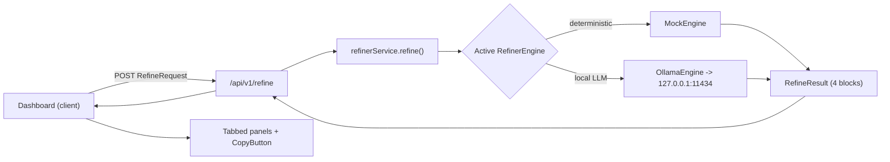

# The Vibe Coder Prompt Refiner Tool — Full-Stack Architectural Layout

> Status: Design locked, pre-implementation. This document is the single source of
> truth for the build. No application source files are written yet.

A production-ready Next.js 16 (App Router, TypeScript) single-page dashboard that
turns a raw, chaotic app idea into four pristine, copy-pasteable blocks:
Refined Prompt, Recommended Tech Stack, Feature List, and Project Architecture.

The refinement is powered by a swappable engine layer: a free, deterministic
**MockEngine** and a local-LLM **OllamaEngine**, both implementing one interface.

---

## Stage 1 — Overview & Goals

- Single-page dashboard at `/` (split-screen: input left, tabbed outputs right).
- Four typed outputs returned from one API call.
- 100% free to run and host on Vercel (MockEngine) with an optional zero-cost
  local-LLM path (OllamaEngine) for higher-quality refinement on the dev machine.
- No database, no paid API keys.



---

## Stage 2 — Tech Stack

- Next.js 16 App Router + React 19, TypeScript (strict mode).
- Tailwind CSS 4.0 (CSS-first `@import "tailwindcss"` + `@theme` inline tokens; no
  legacy `tailwind.config.js` directives).
- shadcn/ui primitives (Button, Tabs, Textarea, Switch, Select, Card, Sonner).
- Geist Sans / Geist Mono via `next/font`.
- Zod for request/response validation.
- Vitest + React Testing Library for unit tests (modern Next 16 / ESM friendly).

---

## Stage 3 — Data Models & Schemas

Location: `src/lib/types.ts` (interfaces) and `src/lib/schemas.ts` (Zod mirrors).

```ts
// ---- Input ----
type TargetIDE = "cursor" | "copilot-workspace";
type ProjectType = "web-app" | "api" | "mobile" | "cli" | "saas" | "other";
type Verbosity = "concise" | "balanced" | "exhaustive";

interface RefineRequest {
  idea: string;            // 10-5000 chars
  targetIDE: TargetIDE;
  projectType: ProjectType;
  verbosity: Verbosity;
  includeTests: boolean;
  preferOpenSource: boolean;
}

// ---- Output: the 4 blocks ----
interface TechChoice { name: string; reason: string; category: string }
interface FeatureItem { label: string; priority: "core" | "nice-to-have" }

interface RefineResult {
  refinedPrompt: string;          // markdown mega-prompt
  techStack: TechChoice[];        // grouped list
  features: FeatureItem[];        // split Core MVP / Nice to Have
  architectureTree: string;       // text tree diagram
}

// ---- Standard API envelope ----
interface ApiResponse<T> {
  success: boolean;
  data: T | null;
  error: string | null;
  message: string;
}
```

`RefineResultSchema` (Zod) is the contract used to **validate any engine output**,
including the JSON returned by Ollama, before it reaches the client.

---

## Stage 4 — The Orchestration Engine (Mock + Ollama) [UPGRADED]

Location: `src/lib/refiner/`. Two interchangeable engines behind one interface so
the route and UI never change when toggling.

### 4.1 The interface — `engine.interface.ts`

```ts
import type { RefineRequest, RefineResult } from "@/lib/types";

export interface RefinerEngine {
  readonly name: "mock" | "ollama";
  refine(req: RefineRequest): Promise<RefineResult>;
}
```

### 4.2 Free deterministic path — `mock-engine.ts`

Rule-based pipeline of pure functions (no keys, Vercel-safe):
`detectDomain` -> `buildRefinedPrompt` -> `recommendStack` ->
`buildFeatureList` -> `buildArchitectureTree`. Presets live in `domain-data.ts`.

### 4.3 Local-LLM path — `ollama-engine.ts`

A class implementing `RefinerEngine` that calls the local Ollama daemon using its
**native JSON mode** (`format: "json"`) and forces a response matching
`RefineResult`. Output is parsed and re-validated with `RefineResultSchema`.

```ts
import type { RefinerEngine } from "./engine.interface";
import type { RefineRequest, RefineResult } from "@/lib/types";
import { RefineResultSchema } from "@/lib/schemas";

const OLLAMA_URL = "http://127.0.0.1:11434/api/generate";
const DEFAULT_MODEL = process.env.OLLAMA_MODEL ?? "llama3.1";

export class OllamaEngine implements RefinerEngine {
  readonly name = "ollama" as const;

  constructor(
    private readonly model: string = DEFAULT_MODEL,
    private readonly url: string = OLLAMA_URL,
  ) {}

  async refine(req: RefineRequest): Promise<RefineResult> {
    const system = this.buildSystemInstruction();
    const prompt = this.buildUserPrompt(req);

    let res: Response;
    try {
      res = await fetch(this.url, {
        method: "POST",
        headers: { "Content-Type": "application/json" },
        body: JSON.stringify({
          model: this.model,
          system,
          prompt,
          format: "json",   // Ollama native JSON mode
          stream: false,
          options: { temperature: 0.4 },
        }),
      });
    } catch {
      throw new Error(
        "Could not reach Ollama at 127.0.0.1:11434. Is `ollama serve` running?",
      );
    }

    if (!res.ok) {
      throw new Error(`Ollama responded with HTTP ${res.status}`);
    }

    // Ollama returns { response: "<stringified JSON>", ... }
    const envelope = (await res.json()) as { response?: string };
    if (!envelope.response) {
      throw new Error("Ollama returned an empty response payload.");
    }

    let parsed: unknown;
    try {
      parsed = JSON.parse(envelope.response);
    } catch {
      throw new Error("Ollama did not return valid JSON for RefineResult.");
    }

    // Re-validate the model output against our strict contract.
    const result = RefineResultSchema.safeParse(parsed);
    if (!result.success) {
      throw new Error(
        `Ollama JSON did not match RefineResult: ${result.error.message}`,
      );
    }
    return result.data;
  }

  /** Strictly force the model to emit our 4-part RefineResult JSON shape. */
  private buildSystemInstruction(): string {
    return [
      "You are an elite full-stack solutions architect.",
      "You MUST respond with a single valid JSON object and nothing else.",
      "The JSON MUST exactly match this TypeScript interface:",
      "{",
      '  "refinedPrompt": string,            // a context-rich markdown mega-prompt',
      '  "techStack": { "name": string, "reason": string, "category": string }[],',
      '  "features": { "label": string, "priority": "core" | "nice-to-have" }[],',
      '  "architectureTree": string          // a plain-text file/dir tree',
      "}",
      "Do not include markdown code fences. Do not add commentary or extra keys.",
    ].join("\n");
  }

  private buildUserPrompt(req: RefineRequest): string {
    return [
      `Raw idea: ${req.idea}`,
      `Target IDE: ${req.targetIDE}`,
      `Project type: ${req.projectType}`,
      `Verbosity: ${req.verbosity}`,
      `Include tests: ${req.includeTests}`,
      `Prefer open source: ${req.preferOpenSource}`,
      "Produce the RefineResult JSON now.",
    ].join("\n");
  }
}
```

### 4.4 Clean engine toggle — `index.ts`

Export both singletons plus a selector so the route can switch via env without
code changes.

```ts
import type { RefinerEngine } from "./engine.interface";
import { MockEngine } from "./mock-engine";
import { OllamaEngine } from "./ollama-engine";

export const mockEngine: RefinerEngine = new MockEngine();
export const ollamaEngine: RefinerEngine = new OllamaEngine();

export type EngineName = RefinerEngine["name"];

/** Toggle source of truth: REFINER_ENGINE="ollama" | "mock" (defaults to mock). */
export function getRefinerEngine(
  name: EngineName = (process.env.REFINER_ENGINE as EngineName) ?? "mock",
): RefinerEngine {
  return name === "ollama" ? ollamaEngine : mockEngine;
}

export const refinerService = {
  refine: (req: Parameters<RefinerEngine["refine"]>[0]) =>
    getRefinerEngine().refine(req),
};

export { MockEngine, OllamaEngine };
export type { RefinerEngine };
```

Default engine is `mock` (keeps Vercel deploy free and offline-safe); flipping
`REFINER_ENGINE=ollama` (or passing the name) uses the local model.

---

## Stage 5 — API Layer

`src/app/api/v1/refine/route.ts` (POST, versioned per standards):

- Parse JSON body, validate with `RefineRequestSchema.safeParse`.
- On invalid input: HTTP 400 with `{ success:false, data:null, error, message }`.
- On success: `refinerService.refine(req)` -> HTTP 200 with the envelope.
- Wrapped in try/catch; engine errors (e.g. Ollama unreachable) return a
  meaningful HTTP 502/500 message without leaking internals.

---

## Stage 6 — Project Structure (File Tree)

```
prompt-refiner/
  src/
    app/
      layout.tsx
      page.tsx
      globals.css                # Tailwind 4 @import + @theme tokens
      api/
        v1/
          refine/
            route.ts
    components/
      dashboard/
        Dashboard.tsx
        InputPanel.tsx
        OutputPanel.tsx
        tabs/
          RefinedPromptTab.tsx
          TechStackTab.tsx
          FeatureListTab.tsx
          ArchitectureTab.tsx
      ui/                        # shadcn primitives
      shared/
        CopyButton.tsx
        GlowCard.tsx
        Header.tsx
        EngineToggle.tsx         # mock <-> ollama switch (dev convenience)
    lib/
      types.ts
      schemas.ts                 # Zod (incl. RefineResultSchema)
      refiner/
        engine.interface.ts
        mock-engine.ts
        ollama-engine.ts
        domain-data.ts
        index.ts                 # mockEngine + ollamaEngine + getRefinerEngine
      utils.ts
    hooks/
      useRefine.ts
  tests/
    mock-engine.test.ts
    ollama-engine.test.ts        # fetch mocked
  .env.example                   # OLLAMA_MODEL, REFINER_ENGINE
  package.json
  tsconfig.json
  next.config.ts
  postcss.config.mjs
  components.json
  README.md
```

---

## Stage 7 — Frontend Components & Split-Screen

- `Dashboard.tsx`: responsive shell. `lg+` = two columns; mobile = stacked.
- `InputPanel.tsx`: raw idea textarea + config toggles + Refine CTA
  (+ optional `EngineToggle` for mock/ollama in dev).
- `OutputPanel.tsx`: shadcn `Tabs` hosting the four tab components.
- Each tab renders its block; `CopyButton` copies raw markdown/text + toast.

---

## Stage 8 — State Management & Hooks

`src/hooks/useRefine.ts`: state machine `idle | loading | success | error`,
holds the latest `RefineResult` and error message, exposes `refine(req)`.
Loading shows shimmer + disabled CTA; right panel has a cyberpunk empty state
before the first run.

---

## Stage 9 — Design System (Tailwind 4 `@theme`)

- Background `zinc-950`, surfaces `zinc-900`, borders `zinc-800`, text `zinc-50`.
- Neon violet `violet-500` accent for active tab, CTA, focus rings, soft glow
  (`shadow-[0_0_20px_theme(violet-500/30)]`).
- Geist Sans body; Geist Mono for code and the architecture tree.

---

## Stage 10 — Testing Strategy

- `mock-engine.test.ts`: unit-test each pure function (domain detect, stack,
  features, architecture, prompt assembly).
- `ollama-engine.test.ts`: mock `fetch`; assert request shape
  (`format: "json"`, system instruction), JSON parsing, Zod validation, and
  error paths (daemon down, bad JSON, schema mismatch).

---

## Stage 11 — Deployment & Execution Roadmap

- Vercel free tier (MockEngine default; Ollama is local-only by design).
- `.env.example`: `REFINER_ENGINE=mock`, `OLLAMA_MODEL=llama3.1`.

Build order once approved:
1. Scaffold app + tooling (Next 16, Tailwind 4, shadcn, Zod, Vitest).
2. Models + Zod schemas (`types.ts`, `schemas.ts`).
3. Engine layer: interface, mock-engine, ollama-engine, domain-data, index.
4. API route `/api/v1/refine`.
5. Layout + design tokens + Header + Dashboard shell.
6. InputPanel + toggles + `useRefine`.
7. OutputPanel + 4 tabs + CopyButton + loading/empty states.
8. Unit tests (mock + ollama).
9. Lint/typecheck, dev-server verify end-to-end.

---

### Notable decisions / flags

- OllamaEngine talks to `http://127.0.0.1:11434/api/generate` with
  `format: "json"`; output is re-validated against `RefineResultSchema`.
- `index.ts` exports `mockEngine` and `ollamaEngine` singletons plus
  `getRefinerEngine()` for clean toggling (env `REFINER_ENGINE`).
- API path is versioned (`/api/v1/refine`) per coding standards.
- Vitest proposed over Jest for Next 16 / ESM / React 19 compatibility.
- No Supabase/database in this MVP (zero DB overhead, as scoped).
